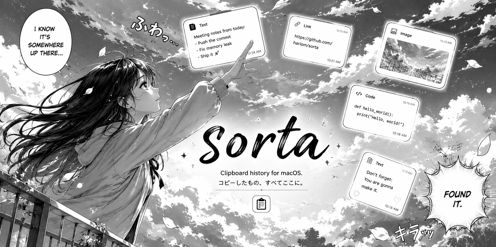

  

# SORTA

Smart, instant, zero-click macOS clipboard inspector and developer HUD. Built natively with Swift, SwiftUI, and AppKit. SORTA runs as an ultra-lightweight background process that monitors system pasteboard changes in real time, classifies payloads through deterministic pattern analysis, and renders an interactive floating HUD for immediate preview, transformation, and drag-and-drop file operations.

> [!WARNING]
> Active Development: SORTA is under active development and rapid iteration. APIs, internal schemas, transformation pipelines, and keyboard mappings may evolve between builds.

---

## Technical Overview

SORTA is engineered as a zero-latency native macOS utility that bridges low-level AppKit event subsystems with SwiftUI reactive state management. Rather than operating as an intrusive modal, it functions as a non-activating floating panel (`NSPanel`) that overlays focused workspaces without stealing system focus or interrupting existing keyboard workflows.

| Component | Technology | Specification |
| :--- | :--- | :--- |
| **Language** | Swift 5.9+ | Modern Swift concurrency, strict concurrency safety, structured state machines |
| **UI Framework** | SwiftUI + AppKit | Hybrid architecture; AppKit for window lifecycle, SwiftUI for declarative view hierarchy |
| **Window Subsystem** | `NSPanel` | Non-activating floating panel with `.hudWindow` visual effect backing and custom layer masks |
| **Pasteboard Pipeline** | `NSPasteboard` | High-frequency polling loop with change count debouncing and process filtering |
| **Drag Engine** | `NSDraggingSource` | Direct Cocoa drag session manager registering file URLs, raw PNG streams, and TIFF buffers |
| **Event Interception** | `NSEvent` Local Monitor | Non-blocking global key interceptors with modifier key tracking and tap counters |
| **Storage Architecture** | In-Memory Ring Buffer | Ephemeral volatile memory store with zero disk footprint for clipboard history |

---

## Core Capabilities

### Real-Time Pasteboard Monitoring and Classification
The pasteboard watcher runs on a scheduled background thread that polls `NSPasteboard.general.changeCount`. When a new item is detected, the payload is immediately extracted and passed through a chain of deterministic classifiers without writing data to persistent storage. Content types are identified using regex heuristics, schema validation, and UTI inspection.

### Drag and Drop Architecture
Images captured by the pasteboard engine can be clicked and dragged directly out of the HUD into any destination application. The drag source writes a temporary file to disk while simultaneously registering multiple pasteboard representations (`public.file-url`, `public.png`, `public.tiff`). This ensures native compatibility whether dropping into Finder folders, browser upload dropzones, or graphics software like Figma and Photoshop.

### Native Visual Effect Backing
The HUD uses AppKit visual effect views configured with behind-window blending modes and dark vibrancy appearances. The window avoids artificial overlays, letting underlying desktop wallpapers and active code editors blur through with optical clarity.

| Feature | Implementation | Behavior |
| :--- | :--- | :--- |
| **Direct Drag and Drop** | `NSDraggingSource` + `NSPasteboardItem` | Direct export into Finder, Figma, Slack, Discord, Chrome, VS Code, and Notes |
| **Payload Classification** | Regex + JSONSerialization + Component Parsers | Automatic categorization into JSON, URLs, Colors, JWT, Timestamps, and Images |
| **Collapsible History** | SwiftUI Navigation Drawer + LazyVStack | Slide-out history list with category pills, search filtering, and memory trimming |
| **Single-Action Workflow** | Direct Pasteboard Injection | One-click copy with animated state feedback and direct paste into the active window |
| **Security Boundaries** | Bundle Identifier Filtering | Password managers and authentication daemons are bypassed completely |

---

## Data Handlers and Transformations

Every clipboard item is processed through dedicated transformation pipelines tailored to developer workflows:

### JSON Formatting
Raw JSON payloads are validated via `JSONSerialization`. If valid, the inspector produces a 2-space indented output with alphabetically sorted keys for predictable diffing and inspection.

### URL and Query Parameter Extraction
URLs are parsed using `URLComponents` to separate the scheme, host domain, and path elements. Query parameters are extracted into an isolated key-value table, while tracking parameters (`utm_*`, `fbclid`, `si`, `ref`) can be scrubbed automatically.

### Color Conversion
Hexadecimal strings and CSS `rgb()` definitions are parsed into RGBA color components. The inspector renders a live preview swatch alongside ready-to-copy declarations for Hex, CSS RGB, and SwiftUI `Color` syntax.

### JWT Token Inspection
Dot-separated three-part JWT strings are split, Base64URL decoded with padding corrections, and formatted as structured JSON claims, allowing instant payload verification without web-based decoders.

### UNIX Timestamps
Numeric timestamp values (10-digit seconds and 13-digit milliseconds) and ISO-8601 strings are converted to localized human-readable dates, absolute time representations, and relative elapsed time descriptions.

### Live Text and On-Device Image OCR
When an image or screenshot is captured, SORTA runs an asynchronous Apple Vision (`VNRecognizeTextRequest`) pass using the local Neural Engine. Extracted text is indexed for real-time fuzzy history search and can be copied directly via the Live Text inspector without third-party OCR utilities.

| Category | Input Criteria | Output / Features |
| :--- | :--- | :--- |
| **Image** | Pasteboard image data | On-device Live Text OCR extraction, searchable text within screenshots, tight aspect framing, multi-format drag export |
| **JSON** | `{ ... }` or `[ ... ]` strings | Formatted 2-space indented hierarchy, sorted keys, syntax validation |
| **URL** | `http://` or `https://` URLs | Parsed host badge, path indicators, isolated query parameter table, tracking sanitization |
| **Color** | `#RRGGBB`, `rgb(...)` strings | Live color swatch, conversions to Hex, RGB, and SwiftUI `Color(red:green:blue:)` |
| **Timestamp** | 10-digit / 13-digit epoch | Full calendar date, localized clock time, relative duration, epoch reference |
| **JWT** | 3-part Base64URL tokens | Decoded claims JSON, token header inspection, payload breakdown |
| **Plain Text** | Unstructured text | Clean monospaced or proportional typography, leading/trailing whitespace cleanup |

---

## Controls and Keybindings

SORTA is designed to be fully navigable via keyboard gestures and menu bar interactions:

| Input | Target Area | Functionality |
| :--- | :--- | :--- |
| **Menu Bar Left Click** | Menu Bar Icon | Directly toggles HUD panel visibility |
| **Menu Bar Right Click** | Menu Bar Icon | Opens system context menu (Preferences, Quit) |
| **Tap `Control` 3x** | Global System | Toggles HUD panel over any active application |
| **`Option + Space`** | Global System | Alternative global toggle shortcut |
| **`Tab`** | HUD Window | Expands or collapses the History Drawer |
| **`↑` / `↓`** | HUD Window | Navigates through clipboard history items |
| **`Return`** | HUD Window | Pastes currently selected snippet into active target app |
| **`Esc`** | HUD Window | Dismisses and hides the HUD panel |
| **Click + Drag** | Image Canvas | Drags image file directly into destination applications |

---

## Architecture and Engineering

SORTA utilizes a modular architecture designed for minimal memory overhead and zero idle CPU utilization:

### Pasteboard Engine
The core loop monitors pasteboard change identifiers. When changes occur, it evaluates the active application bundle identifier against an exclusion blocklist to prevent capturing passwords or sensitive tokens from password managers.

### Event Routing
A dedicated `KeyEventHandlerView` utilizes `NSEvent.addLocalMonitorForEvents` to intercept key commands before standard responder chain consumption. This ensures shortcuts like `Tab`, arrow keys, and `Return` execute reliably without focus stealing.

### Drag and Drop Pipeline
The image presenter wraps a custom AppKit `NSView` conforming to `NSDraggingSource`. Mouse drag thresholds are tracked explicitly, triggering `beginDraggingSession` with an `NSDraggingItem` that provides multi-type pasteboard representations on demand.

| Module | Core Classes | Primary Responsibility |
| :--- | :--- | :--- |
| **Core Panel** | `HUDPanel`, `PanelManager` | Window level configuration, floating mask lifecycle, focus management |
| **Watcher Engine** | `PasteboardWatcher` | Change count polling, secret masking, application blocklisting |
| **View Model** | `HUDViewModel` | Selection state, search query filtering, animated copy feedback |
| **Views** | `SortaHUDView`, `HistoryListView` | Declarative UI, visual effect backing, responsive layout |
| **Drag Controller** | `DraggableImageNSView`, `DragItemProviderHelper` | Native AppKit drag session management and UTI registration |

---

## Security and Privacy Boundaries

SORTA is built with a local-first, privacy-centric design:

- **Password Manager Exclusion**: Copies originating from 1Password, Bitwarden, KeePassXC, Keychain Access, and other credential vaults are discarded at the listener layer.
- **Sensitive Token Masking**: Built-in pattern recognition identifies AWS secret keys (`AKIA...`), GitHub personal access tokens (`ghp_...`), OpenAI API keys (`sk-...`), and private keys, masking them in the user interface.
- **Memory-Only Processing**: Clipboard history is maintained strictly in volatile memory. No text or image data is persisted to disk databases or transmitted over external networks.

| Protection Layer | Target Scope | Security Mechanism |
| :--- | :--- | :--- |
| **Vault Shield** | Password Managers | Bundle identifier filtering drops sensitive copies before ingestion |
| **Token Guard** | API Keys & Secrets | Regex heuristics detect and mask credential signatures |
| **Network Isolation** | Entire Application | Zero outbound HTTP requests, zero telemetry, zero analytics |

---

a project by hariom sharnam
